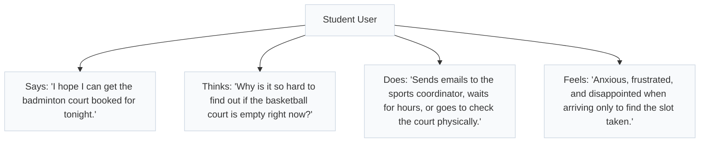

# Empathy Map

This empathy map captures the thoughts, feelings, and behaviors of our target users to design a user-centric booking experience.

## Persona: Student (Active User)

---

## Persona: Facility Coordinator (Approver)

| Quadrant | Details |
| --- | --- |
| **Says** | "I get dozens of booking emails daily. I cannot track which request came first." |
| **Thinks** | "I wish the system would automatically filter out duplicate booking conflicts." |
| **Does** | "Manually verifies student eligibility, updates an Excel spreadsheet, and replies to confirmation emails." |
| **Feels** | "Overwhelmed by repetitive operational tasks and stressed when double-bookings occur." |
