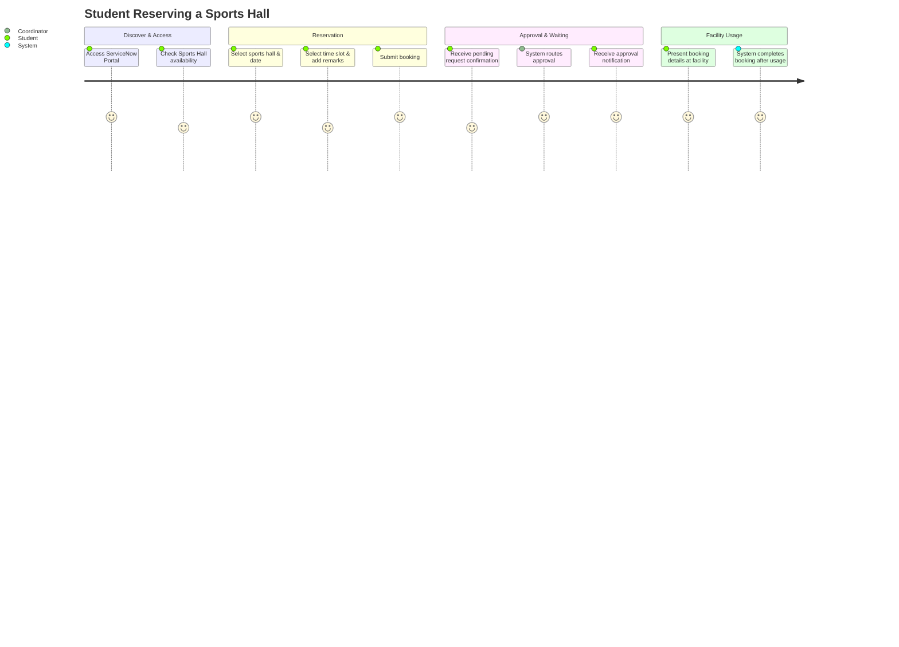

# Customer Journey Map

This Customer Journey Map outlines the user experience lifecycle from discovering the reservation portal to using the sports facility.

---

## Touchpoints & Opportunities

| Phase | Touchpoint | User Emotion | Improvement Opportunity |
| --- | --- | --- | --- |
| **Discover** | Service Portal Homepage | Neutral | Add a quick-link carousel for active facilities. |
| **Reservation** | Time Slot Selector | Happy | Color-code slots (Green/Red) for instant visual scanning. |
| **Approval** | Email notification | Anxious | Include full booking summaries dynamically using Email Scripts. |
| **Usage** | Sports Hall entry | Happy | Allow booking cancellation options from dashboard. |
