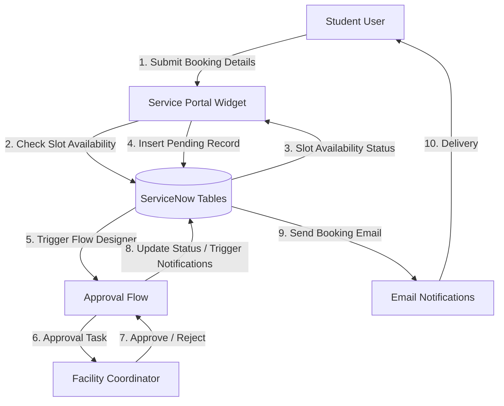

# Data Flow Diagram (DFD)

This Data Flow Diagram shows how data moves through the **Sports Hall Booking System**.

## Level 1 DFD: Reservation & Approvals

---

## Data Repositories
1.  **x_2112820_sports_2_facility**: Stores hall attributes (name, location, capacity).
2.  **x_2112820_sports_2_time_slot**: Stores time slot attributes (times, status).
3.  **x_2112820_sports_2_booking**: Stores reservation transactions (number, user, status).
